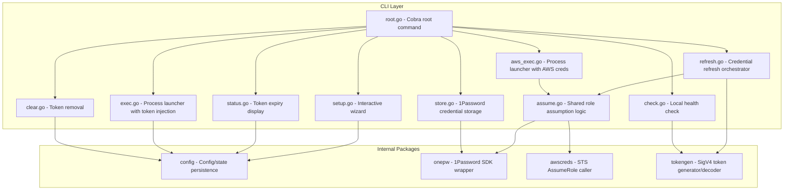

# Design Document: claude-auth CLI

## Overview

claude-auth is a Go CLI that bridges 1Password credential storage with AWS STS role assumption and Anthropic's presigned bearer token format, enabling developers to use Claude Platform on AWS without exposing long-term credentials on disk or polluting their default shell environment.

The tool follows a three-phase flow:
1. **Setup & Store** — Interactive configuration and credential storage in 1Password
2. **Refresh** — Fetch credentials from 1Password, assume an IAM role (with MFA), generate a presigned SigV4 bearer token, and persist it locally
3. **Exec** — Launch a child process with the token injected, replacing the current process via `syscall.Exec`

The architecture is intentionally simple: a single binary with Cobra commands, a thin 1Password SDK wrapper, an AWS STS caller, and a token generator that produces presigned URLs in the format expected by Claude Code.

## Architecture



### Design Decisions

1. **Single-step AssumeRole (not role chaining)**: The tool calls `STS AssumeRole` directly from long-term IAM user credentials with MFA. This avoids the 1-hour hard cap that AWS imposes on role-chained sessions (`GetSessionToken` → `AssumeRole`), allowing sessions up to the role's `MaxSessionDuration` (12h).

2. **Process replacement via `syscall.Exec`**: The `exec` command replaces the current process rather than spawning a child. This ensures correct signal propagation, proper TTY handling for interactive tools like Claude Code, and zero wrapper overhead.

3. **Token-only injection**: The `exec` command injects only the self-contained bearer token (`ANTHROPIC_AWS_API_KEY`) and workspace metadata — never raw AWS credentials. This prevents accidental credential leakage into child process environments.

4. **1Password desktop app integration**: Uses the 1Password SDK's desktop app integration mode, which authenticates via the system's biometric (Touch ID). No service account tokens or CLI sign-in required.

5. **No shell modification**: The tool never modifies shell profiles, rc files, or persistent environment. AWS platform mode is strictly opt-in per `exec` invocation.

## Components and Interfaces

### cmd package (CLI Layer)

| File | Responsibility |
|------|---------------|
| `root.go` | Cobra root command registration, `Execute()` entry point |
| `setup.go` | Interactive configuration wizard with raw-mode terminal input |
| `store.go` | Prompts for IAM keys, stores them in 1Password via `onepw.Client` |
| `refresh.go` | Orchestrates: assume role → generate token → write to disk |
| `exec.go` | Reads stored token, injects env vars, `syscall.Exec` the target command |
| `aws_exec.go` | Assumes role, injects raw AWS creds, `syscall.Exec` the target command |
| `status.go` | Reads `state.json`, displays remaining token time |
| `check.go` | Loads config, decodes token locally, verifies region match and expiry |
| `clear.go` | Deletes `anthropic.env` and `state.json` |
| `assume.go` | Shared helper: fetches 1Password creds + assumes role (used by `refresh` and `aws-exec`) |

### internal/config

```go
// Config holds the user's persistent configuration
type Config struct {
    OnePasswordAccount string
    Vault              string
    Item               string
    RoleARN            string
    MFASerial          string  // empty if role doesn't require MFA
    WorkspaceRegion    string
    WorkspaceID        string
    SessionDuration    int     // hours (1-12)
}

// State holds ephemeral runtime state (token expiry)
type State struct {
    AnthropicTokenExpiry string // RFC3339 timestamp
}

// Key functions:
func DefaultConfig() Config
func Load() (*Config, error)
func Save(cfg *Config) error
func Exists() bool
func LoadState() (*State, error)
func SaveState(s *State) error
func Dir() (string, error)    // ~/.config/claude-auth/
func Path() (string, error)   // ~/.config/claude-auth/config.json
func EnvPath() (string, error) // ~/.config/claude-auth/anthropic.env
func StatePath() (string, error) // ~/.config/claude-auth/state.json
```

### internal/onepw

```go
type Client struct { op *onepassword.Client }

type Credentials struct {
    AccessKeyID     string
    SecretAccessKey  string
    TOTP            string // current MFA code, empty if no TOTP field
}

func New(ctx context.Context, accountName string) (*Client, error)
func (c *Client) GetCredentials(ctx context.Context, vault, item string) (*Credentials, error)
func (c *Client) StoreCredentials(ctx context.Context, vault, item, accessKeyID, secretAccessKey string) error
```

### internal/awscreds

```go
type SessionCredentials struct {
    AccessKeyID     string
    SecretAccessKey  string
    SessionToken    string
    Expiry          time.Time
}

func (s *SessionCredentials) ToAWSCredentials() (aws.Credentials, error)
func AssumeRole(ctx context.Context, accessKeyID, secretAccessKey, roleARN, mfaSerial, tokenCode, region string, durationHours int) (*SessionCredentials, error)
```

### internal/tokengen

```go
type TokenInfo struct {
    Region string
    Expiry time.Time
}

func Generate(ctx context.Context, creds aws.Credentials, region string, expiry time.Duration) (string, error)
func Decode(token string) (*TokenInfo, error)
```

## Data Models

### Configuration File (`~/.config/claude-auth/config.json`)

```json
{
  "onepassword_account": "user@example.com",
  "vault": "Developer",
  "item": "AWS IAM - Claude",
  "role_arn": "arn:aws:iam::123456789012:role/claude-platform",
  "mfa_serial": "arn:aws:iam::123456789012:mfa/username",
  "workspace_region": "eu-west-1",
  "workspace_id": "wrkspc_abc123",
  "session_duration_hours": 12
}
```

- Permissions: `0600` (file), `0700` (directory)
- Location: `~/.config/claude-auth/config.json`

### Token File (`~/.config/claude-auth/anthropic.env`)

```
ANTHROPIC_AWS_API_KEY=aws-external-anthropic-api-key-<base64-encoded-presigned-url>
```

- Permissions: `0600`
- Format: Single `KEY=VALUE` line, parseable by line scanner

### State File (`~/.config/claude-auth/state.json`)

```json
{
  "anthropic_token_expiry": "2025-01-15T22:00:00Z"
}
```

- Permissions: `0600`
- Expiry stored as RFC3339 UTC timestamp

### Token Format

The bearer token structure:

```
aws-external-anthropic-api-key-<BASE64>
```

Where `<BASE64>` decodes to:

```
aws-external-anthropic.amazonaws.com/?Action=CallWithBearerToken&X-Amz-Algorithm=AWS4-HMAC-SHA256&X-Amz-Credential=<key>/<date>/<region>/aws-external-anthropic/aws4_request&X-Amz-Date=<timestamp>&X-Amz-Expires=<seconds>&X-Amz-SignedHeaders=host&X-Amz-Signature=<sig>&X-Amz-Security-Token=<session-token>&Version=1
```

### Environment Variables Injected by `exec`

| Variable | Source |
|----------|--------|
| `CLAUDE_CODE_USE_ANTHROPIC_AWS` | Hardcoded `1` |
| `AWS_REGION` | `config.WorkspaceRegion` |
| `ANTHROPIC_AWS_WORKSPACE_ID` | `config.WorkspaceID` |
| `ANTHROPIC_AWS_API_KEY` | Read from `anthropic.env` |

## Correctness Properties

*A property is a characteristic or behavior that should hold true across all valid executions of a system — essentially, a formal statement about what the system should do. Properties serve as the bridge between human-readable specifications and machine-verifiable correctness guarantees.*

### Property 1: Config serialization round-trip

*For any* valid `Config` struct (with non-empty required fields and session duration between 1 and 12), saving it via `config.Save` and then loading it via `config.Load` SHALL produce a struct equal to the original, and the written file SHALL have permissions `0600`.

**Validates: Requirements 1.4, 1.6**

### Property 2: Prompt returns default on empty input

*For any* non-empty default string and an empty user input (empty string or whitespace-only), the `prompt` function SHALL return the default value unchanged.

**Validates: Requirements 1.2**

### Property 3: Token encode/decode round-trip

*For any* valid AWS credentials (with non-empty access key, secret key, and session token), any valid AWS region string, and any duration between 1 second and 12 hours, generating a token via `tokengen.Generate` and then decoding it via `tokengen.Decode` SHALL produce a `TokenInfo` where the region matches the input region and the expiry is within 1 second of `now + duration`.

**Validates: Requirements 8.5, 9.1, 9.2, 9.3**

### Property 4: Token structural validity

*For any* valid AWS credentials and region, the token produced by `tokengen.Generate` SHALL: start with the prefix `aws-external-anthropic-api-key-`, have a base64-decodable payload after the prefix, and the decoded payload SHALL contain `Action=CallWithBearerToken`, `X-Amz-Algorithm=`, `X-Amz-Credential=` (with the input region in the third slash-delimited segment), `X-Amz-Expires=` (matching the input duration in seconds), and end with `&Version=1`.

**Validates: Requirements 8.1, 8.2, 8.3, 8.4**

### Property 5: State serialization round-trip

*For any* valid RFC3339 timestamp string, saving a `State` with that timestamp via `config.SaveState` and then loading it via `config.LoadState` SHALL produce a `State` with the same `AnthropicTokenExpiry` value.

**Validates: Requirements 3.8**

### Property 6: Exec environment correctness

*For any* valid config (with non-empty workspace region and workspace ID) and any non-empty API key string, the environment variable set constructed for `exec` SHALL contain exactly `CLAUDE_CODE_USE_ANTHROPIC_AWS=1`, `AWS_REGION=<workspace_region>`, `ANTHROPIC_AWS_WORKSPACE_ID=<workspace_id>`, and `ANTHROPIC_AWS_API_KEY=<api_key>`, and SHALL NOT contain `AWS_ACCESS_KEY_ID`, `AWS_SECRET_ACCESS_KEY`, or `AWS_SESSION_TOKEN` as injected variables.

**Validates: Requirements 4.3, 4.5**

### Property 7: Time remaining calculation

*For any* future timestamp (between 1 minute and 24 hours from now), the `printExpiry` function SHALL display hours and minutes where `displayed_hours * 60 + displayed_minutes` equals `floor(total_minutes_remaining)` (i.e., truncated to whole minutes, not rounded).

**Validates: Requirements 5.3**

### Property 8: MFA code format validation

*For any* string that is not exactly 6 ASCII decimal digits, the MFA validation logic SHALL reject it with an error. *For any* string that is exactly 6 ASCII decimal digits, the validation SHALL accept it.

**Validates: Requirements 10.4**

> **Note:** Property 8 represents a gap in the current implementation. The existing code in `assume.go` accepts any non-empty string as an MFA code without format validation. This property documents the required behavior per the requirements.

## Error Handling

### Error Categories

| Category | Handling Strategy | Example |
|----------|------------------|---------|
| Configuration missing | Direct user to `claude-auth setup` | Config file not found |
| Token missing/expired | Direct user to `claude-auth refresh` | No `anthropic.env` |
| 1Password connection failure | Report connection error with guidance to check app is running/unlocked | SDK init fails |
| 1Password item not found | Direct user to `claude-auth store` | Item missing from vault |
| STS AssumeRole failure | Report AWS error; special handling for duration/MFA errors | Invalid MFA, duration too long |
| Command not found | Report missing binary name | `exec` with invalid command |
| Filesystem errors | Report path and OS error | Permission denied on config write |

### Error Propagation Pattern

All commands use Cobra's `RunE` pattern, returning errors to the framework which prints them to stderr and exits with code 1. Commands never call `os.Exit` directly (except the raw-mode Ctrl+C handler in `setup.go`).

### Graceful Degradation

- `check` continues after decode failures (displays warning, doesn't crash)
- `clear` treats "file not found" as success (idempotent)
- `LoadState` returns an empty state (not an error) when the file is missing
- `status` handles malformed timestamps by displaying "unknown"

### Identified Gaps

1. **MFA code format validation (Req 10.4)**: The current `assume.go` accepts any non-empty string. Should validate exactly 6 numeric digits before passing to STS.
2. **Default command for `exec` (Req 4.1)**: The current code requires a command argument. The requirement specifies `claude` as the default when no command is given.
3. **Token decode error strictness (Req 9.7)**: The current `Decode` function returns an empty region when `X-Amz-Credential` is missing rather than returning an error as specified.

## Testing Strategy

### Test Framework

- **Unit tests**: Go's standard `testing` package (already in use)
- **Property-based tests**: [rapid](https://github.com/flyingmutant/rapid) — a Go property-based testing library
- **Mocking**: Interface-based mocking for 1Password and STS interactions

### Property-Based Tests

Each correctness property maps to a single property-based test with minimum 100 iterations:

| Property | Test Location | Generator Strategy |
|----------|--------------|-------------------|
| 1: Config round-trip | `internal/config/config_prop_test.go` | Random strings for all fields, random int 1-12 for duration |
| 2: Prompt default | `cmd/setup_prop_test.go` | Random non-empty strings as defaults |
| 3: Token round-trip | `internal/tokengen/token_prop_test.go` | Random valid AWS credential structs, random region strings, random durations |
| 4: Token structure | `internal/tokengen/token_prop_test.go` | Same generators as Property 3 |
| 5: State round-trip | `internal/config/config_prop_test.go` | Random RFC3339 timestamps |
| 6: Exec env correctness | `cmd/exec_prop_test.go` | Random config values and API key strings |
| 7: Time remaining | `cmd/status_prop_test.go` | Random future timestamps within 24h |
| 8: MFA validation | `cmd/assume_prop_test.go` | Random strings (both valid 6-digit and invalid) |

### Unit Tests (Example-Based)

Focus areas for example-based tests:
- Setup wizard flow (prompt ordering, required field validation)
- Error messages contain expected guidance text
- `clear` idempotence (no files, one file, both files)
- `check` graceful degradation with malformed tokens
- Edge cases: empty config directory, permission errors, corrupt JSON

### Integration Tests

Require 1Password desktop app and AWS credentials (run manually, not in CI):
- Full `store` → `refresh` → `exec` flow
- MFA with live TOTP from 1Password
- Role assumption with real STS

### Test Configuration

```go
// Property test tag format:
// Feature: claude-auth-cli, Property {N}: {title}

// Example:
// Feature: claude-auth-cli, Property 3: Token encode/decode round-trip
```

Each property test runs a minimum of 100 iterations via `rapid.Check`.

