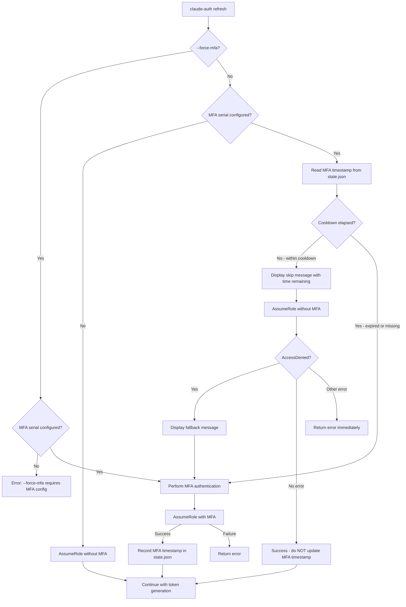

# Design Document: MFA Rate-Limiting

## Overview

MFA rate-limiting reduces developer friction by tracking when MFA was last successfully used and skipping the MFA step during credential refresh if the previous authentication occurred within a configurable cooldown window. This avoids repeated TOTP prompts for developers who refresh credentials multiple times per day.

The feature integrates into the existing `refresh` flow by adding a decision point before the 1Password TOTP fetch: if a recent MFA timestamp exists in state and the cooldown hasn't elapsed, the tool assumes the role without MFA parameters. If that assumption fails with AccessDenied, it falls back to a full MFA flow.

Key design decisions:
- **State co-location**: MFA timestamp is stored in the existing `state.json` alongside token expiry, keeping all ephemeral state in one file.
- **Fail-open on state errors**: If state can't be read or is malformed, the system proceeds with MFA (the safe default).
- **Fallback on AccessDenied**: When a cooldown-skipped assume fails because the role actually requires MFA, the tool automatically retries with MFA rather than failing.
- **Zero means disabled**: A cooldown of 0 minutes disables rate-limiting entirely, always requiring MFA.

## Architecture



The MFA rate-limiting logic is a new decision layer inserted between config loading and the existing `assumeConfiguredRole` function. It does not change the STS interaction itself — only whether MFA parameters are included in the request.

## Components and Interfaces

### New: `internal/mfa` package

This package encapsulates all MFA cooldown logic, keeping it testable in isolation from CLI concerns.

```go
package mfa

import "time"

// Tracker manages MFA cooldown state: reading/writing timestamps and
// evaluating whether MFA should be skipped.
type Tracker struct {
    clock func() time.Time // injectable for testing
}

// NewTracker creates a Tracker using the real system clock.
func NewTracker() *Tracker

// NewTrackerWithClock creates a Tracker with an injectable clock for testing.
func NewTrackerWithClock(clock func() time.Time) *Tracker

// ShouldSkipMFA determines whether MFA can be skipped based on the last
// successful MFA time and the configured cooldown duration.
// Returns (skip bool, remaining time.Duration).
// If lastMFA is zero or cooldown is 0, returns (false, 0).
func (t *Tracker) ShouldSkipMFA(lastMFA time.Time, cooldownMinutes int) (skip bool, remaining time.Duration)

// RecordMFA returns the current UTC time formatted as RFC3339, suitable
// for persisting to state.
func (t *Tracker) RecordMFA() string

// ParseMFATimestamp parses an RFC3339 string into a time.Time.
// Returns zero time if the string is empty or invalid.
func ParseMFATimestamp(s string) time.Time

// FormatRemaining formats a duration as "Xh Ym" with truncation to whole minutes.
func FormatRemaining(d time.Duration) string

// ValidateCooldownMinutes validates a string input for the cooldown config field.
// Returns the parsed integer value or an error if invalid (non-integer, negative).
func ValidateCooldownMinutes(input string) (int, error)
```

### Modified: `internal/config` package

```go
// Config gains a new field:
type Config struct {
    // ... existing fields ...
    MFACooldownMinutes *int `json:"mfa_cooldown_minutes,omitempty"`
}

// GetMFACooldownMinutes returns the configured cooldown or the default (60).
func (c *Config) GetMFACooldownMinutes() int

// State gains a new field:
type State struct {
    AnthropicTokenExpiry string `json:"anthropic_token_expiry"`
    LastMFASuccess       string `json:"last_mfa_success,omitempty"`
}
```

### Modified: `cmd/refresh.go`

- Adds `--force-mfa` boolean flag
- Inserts MFA cooldown evaluation before calling `assumeConfiguredRole`
- Handles the AccessDenied fallback retry logic
- Records MFA timestamp on successful MFA authentication

### Modified: `cmd/assume.go`

- Refactored to accept a `skipMFA bool` parameter so the refresh command can control whether MFA parameters are included
- New function signature: `assumeConfiguredRole(ctx, cfg, skipMFA)` or split into `assumeRoleWithMFA` / `assumeRoleWithoutMFA`

### Modified: `cmd/status.go`

- Displays MFA cooldown status (time remaining, expired, not used, disabled)
- Respects empty MFA serial (omits MFA info entirely)

### Modified: `cmd/setup.go`

- Prompts for `mfa_cooldown_minutes` when MFA serial is non-empty
- Validates input (must be non-negative integer)

### Modified: `cmd/clear.go`

- Already removes state.json which will now contain the MFA timestamp — no code change needed beyond updating the confirmation message

## Data Models

### State File (`~/.config/claude-auth/state.json`)

```json
{
  "anthropic_token_expiry": "2025-01-15T14:30:00Z",
  "last_mfa_success": "2025-01-15T13:00:00Z"
}
```

The `last_mfa_success` field:
- Written as RFC3339 UTC timestamp when MFA authentication succeeds
- Omitted (or empty string) when MFA has never been used
- Removed when `claude-auth clear` deletes the state file

### Config File (`~/.config/claude-auth/config.json`)

```json
{
  "onepassword_account": "my-team",
  "vault": "Developer",
  "item": "AWS IAM - Claude",
  "role_arn": "arn:aws:iam::123456789012:role/claude-platform",
  "mfa_serial": "arn:aws:iam::123456789012:mfa/user",
  "workspace_region": "eu-west-1",
  "workspace_id": "ws-abc123",
  "session_duration_hours": 12,
  "mfa_cooldown_minutes": 60
}
```

The `mfa_cooldown_minutes` field:
- Optional; defaults to 60 when absent
- Value of 0 disables rate-limiting (MFA required every time)
- Must be a non-negative integer
- No upper bound enforced

## Correctness Properties

*A property is a characteristic or behavior that should hold true across all valid executions of a system — essentially, a formal statement about what the system should do. Properties serve as the bridge between human-readable specifications and machine-verifiable correctness guarantees.*

### Property 1: MFA cooldown decision correctness

*For any* last MFA timestamp, current time, and cooldown duration (in minutes), the `ShouldSkipMFA` function SHALL return `skip=true` if and only if the last MFA timestamp is non-zero AND the cooldown is greater than zero AND the elapsed time (current - lastMFA) is strictly less than the cooldown duration.

**Validates: Requirements 2.2, 2.3, 3.3**

### Property 2: MFA timestamp recording invariant

*For any* AssumeRole result, the MFA timestamp in state SHALL be updated if and only if a non-empty token code was provided in the request. When no token code is provided (MFA skipped), any pre-existing MFA timestamp SHALL be preserved unchanged.

**Validates: Requirements 1.1, 1.2**

### Property 3: Cooldown time remaining formatting

*For any* duration between 0 and the maximum cooldown window, `FormatRemaining` SHALL produce a string in the format `"Xh Ym"` where X is the truncated hours and Y is the truncated remaining minutes, such that `X*60 + Y` equals the total minutes obtained by truncating the duration to whole minutes.

**Validates: Requirements 2.6, 5.1**

### Property 4: Cooldown configuration validation

*For any* input string, `ValidateCooldownMinutes` SHALL return a non-negative integer and nil error if and only if the string represents a valid non-negative integer (no decimals, no leading/trailing non-numeric characters). For all other strings (negative integers, decimals, empty strings, non-numeric text), it SHALL return an error.

**Validates: Requirements 3.4, 3.5, 3.6**

### Property 5: Config default value for missing cooldown field

*For any* valid config JSON that does not contain the `mfa_cooldown_minutes` field, loading the config SHALL yield a cooldown value of 60 minutes.

**Validates: Requirements 3.1**

### Property 6: Non-AccessDenied errors bypass fallback

*For any* STS error that is not an AccessDenied error, when the error occurs during a cooldown-skipped (MFA-less) AssumeRole attempt, the system SHALL return that error immediately without attempting MFA fallback.

**Validates: Requirements 6.4**

## Error Handling

| Scenario | Behavior |
|----------|----------|
| State file unreadable (permissions, corruption) | Log warning to stderr, proceed with MFA (fail-open) |
| State file unwritable after successful MFA | Log warning to stderr, continue with refresh (credentials still valid) |
| Invalid RFC3339 in `last_mfa_success` | Treat as absent, proceed with MFA |
| AssumeRole without MFA → AccessDenied | Display fallback message, retry with MFA exactly once |
| AssumeRole without MFA → other error | Return error immediately, no fallback |
| Fallback MFA attempt fails | Return the MFA attempt error, no further retries |
| `--force-mfa` with empty MFA serial | Return error: "--force-mfa requires MFA to be configured" |
| Negative cooldown value in setup | Reject with error message, re-prompt |
| Non-integer cooldown value in setup | Reject with error message, re-prompt |

## Testing Strategy

### Property-Based Tests (using `pgregory.net/rapid`)

The project already uses `rapid` for property-based testing. Each correctness property maps to a property-based test with minimum 100 iterations:

1. **`TestPropertyMFACooldownDecision`** — Generates random (lastMFA, now, cooldownMinutes) tuples and verifies the skip decision matches the specification.
   - Tag: `Feature: mfa-rate-limiting, Property 1: MFA cooldown decision correctness`

2. **`TestPropertyMFATimestampRecording`** — Generates random assume scenarios (with/without token code, with/without pre-existing timestamp) and verifies the state mutation rules.
   - Tag: `Feature: mfa-rate-limiting, Property 2: MFA timestamp recording invariant`

3. **`TestPropertyFormatRemaining`** — Generates random durations and verifies the output format and arithmetic correctness.
   - Tag: `Feature: mfa-rate-limiting, Property 3: Cooldown time remaining formatting`

4. **`TestPropertyValidateCooldownMinutes`** — Generates random strings (valid integers, negative integers, decimals, text) and verifies acceptance/rejection.
   - Tag: `Feature: mfa-rate-limiting, Property 4: Cooldown configuration validation`

5. **`TestPropertyConfigDefaultCooldown`** — Generates random valid config JSON without the cooldown field and verifies the default is 60.
   - Tag: `Feature: mfa-rate-limiting, Property 5: Config default value for missing cooldown field`

6. **`TestPropertyNonAccessDeniedNoFallback`** — Generates random non-AccessDenied error types and verifies no fallback is triggered.
   - Tag: `Feature: mfa-rate-limiting, Property 6: Non-AccessDenied errors bypass fallback`

### Unit Tests (example-based)

- Setup wizard prompts for cooldown when MFA serial is non-empty
- `--force-mfa` flag exists and defaults to false
- `--force-mfa` with empty MFA serial returns error
- AccessDenied triggers exactly one MFA retry
- Fallback MFA failure returns second error
- Status display messages for each state (within cooldown, expired, no timestamp, disabled, no MFA serial)
- Clear removes state file and next refresh requires MFA
- State file created with correct permissions when missing

### Integration Tests

- End-to-end refresh with mocked STS: verify cooldown skip → fallback → success flow
- Setup wizard with piped input: verify cooldown prompt and validation loop
